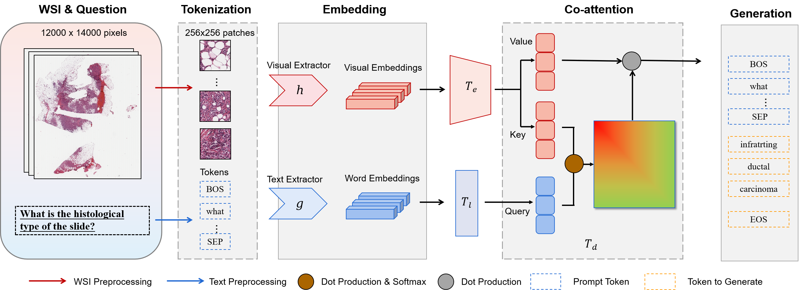
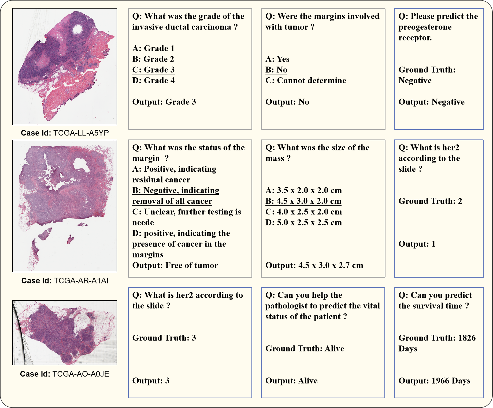

# WSI-VQA: Interpreting Whole Slide Images by Generative Visual Question Answering [ECCV 2024]


=====

[Arxiv](https://arxiv.org/abs/2407.05603)

**Summary** We propose a framework to achieve WSI-VQA. It helps pathologists to obtain the result of carcinoma grading, immunohistochemical biomarker prediction, and survival outcome prediction following the visual question-answering pattern. We also propose a scalable pipeline to automatically curate VQA pairs for whole slide images. The WSI-VQA dataset <a href="https://drive.google.com/file/d/1l8XUgDKgzDCZzneLG7PZFbUmL9NP7GhF/view?usp=drive_link" target="blank"><b>Link</b></a> is now available here.




## Pre-requisites:
We will share our collected dataset but WSIs still need to be preprocessed due to their large resolution.
For a quick start, we provide several WSI features after processing in the repository. You can now download our code and directly run the code.
### Downloading TCGA Slides
To download diagnostic WSIs (formatted as .svs files), please refer to the [NIH Genomic Data Commons Data Portal](https://portal.gdc.cancer.gov/). WSIs for each cancer type can be downloaded using the [GDC Data Transfer Tool](https://docs.gdc.cancer.gov/Data_Transfer_Tool/Users_Guide/Data_Download_and_Upload/).

### Processing Whole Slide Images
To process WSIs, first, the tissue regions in each biopsy slide are segmented using Otsu's Segmentation on a downsampled WSI using OpenSlide. The 256 x 256 patches without spatial overlapping are extracted from the segmented tissue regions at the desired magnification. Consequently, a pretrained backbone is used to encode raw image patches into feature vectors, which we then save as .pt files for each WSI. We achieve the pre-processing of WSIs by using <a href="https://github.com/mahmoodlab/CLAM" target="blank"><b>CLAM</b></a>

### Data Arrangement
Put WSI features under **./dataset/WSI_features**

Put our provided file (WsiVQA.json) under **./dataset/WSI_captions**

## Environment
```shell
* Linux (Tested on Ubuntu 18.04) 
* NVIDIA GPU (Tested on Nvidia GeForce A100) with CUDA 12.0
* Python==3.8
* torch==1.10.0+cu111
* torchvision==0.11.0+cu111
* pycocoevalcap==1.2
* pycocotools==2.0.7
* transformers==4.33.3
```

## Running Experiments
Experiments can be run using the following generic command-line:
### Training model
```shell
python main.py --mode 'Train' --n_gpu <GPUs to be used, e.g '0,1,2,3' for 4 cards training> 
```
### Testing model
```shell
python main.py --mode 'Test' --image_dir <SLIDE FEATURE PATH> --ann_path <CAPTION PATH> --split_path <PATH to the directory containing the train/val/test splits> --checkpoint_dir <PATH TO CKPT>
```
## Examples


Several examples of the WSIs and their corresponding VQA pairs. The pairs
in the grey rectangle are from the close-ended subset which has multiple choices while
the ones in the blue rectangle are from the open-ended subset. The choice which is
underlined is the right answer. These questions are all challenging because they require
sufficient medical knowledge and understanding of complex characteristics in the gi-
gapixel WSIs.
